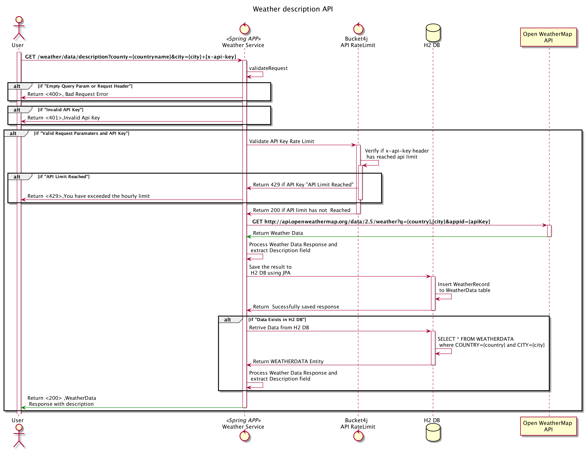

 Weather Services API
=========================================
Weather Service API Fronts  OpenWeatherMap api and will return the weather description based on the country and city name.This application is developed using below tech stack

### Development Stack
- Swagger for API documentation
- PlantUml for Flow diagram
- Java 11
- Spring Boot 2.4.2.RELEASE
- Sring Bucket4j for API Rate Limit
- Caffeine for caching
- H2 for Stanalone DB
- Gradle 6.8.3 (gradlew can be used) 
- Spring Spock for Unit Test
- Mocha and SuperTest and Chai frameworks
 for API-Tests
- Jacoco Code Coverage for Unit Testing 

## Application Flow Digram



## Assumption:
Below setup is for MAC machines

## Reading guide
File names are relative to this repository's root unless otherwise stated

### Set up guide for  Mac
- install homebrew
- install sdkman
  Please follow the steps to install sdkman on mac https://sdkman.io/usage
- install openjdk using sdkman  
    sdk install java 11.0.2-open
- install npm [API TEST]
    brew install npm
- install gradle (Optional as gradlew can be used)
   sdk install gradle 6.7

### Repository  Layout  
```
.
├── README.md
├── api-tests
│   ├── node_modules //Node modules required for api-test
│   ├── package-lock.json
│   ├── package.json 
│   └── test 
│         ├──....//api-test js files
├── build.gradle //Build file
├── design
|    └── swagger.yaml //Swagger documentation
|    └── GetWeatherData.puml //Plantuml file
|    └── GetWeatherDataFlow.png //Flow diagram 
├── gradle
│   └── wrapper
├── gradlew
├── gradlew.bat
├── postman-collection  //PostMan collection for the API's
│   └── WeatherServiceApiRateLimit.postman_test_run.json [Postman runner]
│   └── WeatherServiceAPI.postman_collection.json
├── settings.gradle
└── src
    ├── main
    │   ├── java
    │   │   └── ..//Application source code
    │   └── resources
    │       └─ application.yaml 
    │  
    └── test
        ├── groovy
        │   └── .. //Spring spock test files
        └── resources


```

### Running application locally 
Before running the application ensure that the setup required for mac is completed
     Clone the repo using git
   -  git clone https://github.com/raghunadhpokkalath/weather-service.git
   -  cd weather-service
   - run "./gradlew clean build"  (This will build and run the test .Jacoco plugin is integrated to ensure there is a proper code coverage)
    Once the build is completed.Run the below  commands
   - run "./gradlew bootRun"  ("This will start the application in 8080 port")
   - access the api using below endpoint or import the postman collection from "postman-collection/WeatherServiceAPI.postman_collection.json"
   - Weather  API  Endpoint [Please pass http header x-api-key with
    one of the valid api key from application.yaml] 
    http://localhost:8080/weather/data/description?county=uk&city=london 
   - Swagger-ui  - http://localhost:8080/weather/swagger-ui.html

### Running API-Tests
 Before running api-test ensure that application is running at 8080 port
 - cd api-tests 
 - "Before running npm ensure that npm is installed on your local machine
 -  run 'npm test'


 
### H2 DB console
H2 in-memory database is used to store the weather data once retrived from open api .The H2 console can be accessed using below link 

http://localhost:8080/weather/h2-console

Before clicking connect button .Please make sure JDBC URL is configured as "jdbc:h2:mem:weatherdb"

click connect without giving a password for user 'sa' 